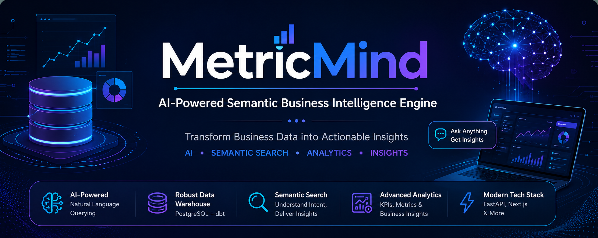

<p align="center">
  
</p>

<h1 align="center">🚀 MetricMind</h1>

<p align="center">
AI-Powered Semantic Business Intelligence Engine
</p>


# 🚀 MetricMind

### AI-Powered Semantic Business Intelligence Engine

Transform Business Data into Actionable Insights using Artificial Intelligence, Semantic Search, and Business Intelligence.

</div>

---
<p align="center">


</p>

# 📖 Overview

MetricMind is an AI-powered Semantic Business Intelligence (BI) Engine that enables users to analyze business data using natural language.

Instead of writing SQL queries, users can simply ask questions in plain English and receive meaningful business insights through AI-powered analytics and interactive dashboards.
---

# ✨ Key Features

- 🤖 AI-powered Natural Language Querying
- 📊 Business Intelligence Dashboards
- 🏗️ PostgreSQL Data Warehouse
- 🔄 Data Transformation using dbt
- 📈 Business Metrics & Analytics
- ⚡ FastAPI Backend Services
- 🎨 Interactive Next.js Frontend
- 🔍 Semantic Query Processing
- ✅ Automated Data Quality Testing
- 📚 Auto-generated Documentation
---

# 🏗️ System Architecture

```text
                    +----------------------+
                    |        User          |
                    +----------+-----------+
                               |
                               v
                  Natural Language Query
                               |
                               v
                    +----------------------+
                    |  AI / LLM Processing |
                    +----------+-----------+
                               |
                               v
                    +----------------------+
                    |   Semantic Layer     |
                    +----------+-----------+
                               |
                               v
                    +----------------------+
                    |   FastAPI Backend    |
                    +----------+-----------+
                               |
                               v
                    +----------------------+
                    | PostgreSQL Database  |
                    +----------+-----------+
                               |
                               v
                    +----------------------+
                    |    dbt Warehouse     |
                    +----------+-----------+
                               |
                               v
                    +----------------------+
                    | Analytics & Metrics  |
                    +----------+-----------+
                               |
                               v
                    +----------------------+
                    | Next.js Dashboard    |
                    +----------------------+
```
---

# 📂 Repository Structure

```text
metric-mind/
│
├── backend/                  # FastAPI backend services
├── frontend/                 # Next.js frontend application
├── semantic-layer/           # Semantic query processing
├── warehouse/
│   └── metricmind_dbt/
│       ├── analyses/
│       ├── macros/
│       ├── models/
│       │   ├── staging/
│       │   ├── marts/
│       │   │   ├── analytics/
│       │   │   ├── facts/
│       │   │   ├── metrics/
│       │   │   └── dimensions/
│       ├── seeds/
│       ├── snapshots/
│       ├── tests/
│       └── schema.yml
│
├── datasets/
├── docs/
├── README.md
└── LICENSE
```
---

# 🛠️ Technology Stack

| Category | Technologies |
|----------|--------------|
| Programming Language | Python, SQL |
| Frontend | Next.js, React, Tailwind CSS |
| Backend | FastAPI |
| Database | PostgreSQL |
| Data Transformation | dbt (Data Build Tool) |
| AI | Groq API, Llama Models |
| Version Control | Git, GitHub |
---

# ⚙️ Installation

## 1. Clone the Repository

```bash
git clone https://github.com/sreejagubbala/metric-mind.git
```

```bash
cd metric-mind
```

---

## 2. Create a Virtual Environment

```bash
python -m venv venv
```

### Windows

```bash
venv\Scripts\activate
```

### Linux / macOS

```bash
source venv/bin/activate
```

---

## 3. Install Backend Dependencies

```bash
cd backend
pip install -r requirements.txt
```

---

## 4. Install Frontend Dependencies

```bash
cd ../frontend
npm install
```

---

## 5. Configure PostgreSQL

- Install PostgreSQL.
- Create a database.
- Import the Global Superstore dataset.
- Update the database credentials in the configuration files.
---

# ▶️ Running the Project

## Start the Backend

```bash
cd backend
uvicorn main:app --reload
```

Backend URL

```
http://localhost:8000
```

---

## Start the Frontend

```bash
cd frontend
npm run dev
```

Frontend URL

```
http://localhost:3000
```

---

## Run dbt Models

```bash
cd warehouse/metricmind_dbt
```

Run all models

```bash
dbt run
```

Run tests

```bash
dbt test
```

Generate documentation

```bash
dbt docs generate
```

Serve documentation

```bash
dbt docs serve
```
---

# 🏗️ Data Warehouse

The data warehouse was developed using **PostgreSQL** and **dbt**. It transforms raw transactional data into analytics-ready models following a layered architecture.

## Staging Layer

- `stg_superstore`

Prepares and cleans the raw Superstore dataset before it is used by downstream models.

## Fact Model

- `fact_sales`

Stores sales transactions including customer, product, order, quantity, sales, discount, and profit information.

## Dimension Models

- `dim_customer`
- `dim_product`
- `dim_region`

These models organize descriptive information for efficient reporting and analysis.

## Metric Models

- Revenue Model
- Cost Model
- Profit Model
- Margin Model

These models calculate important business performance metrics.

## Analytics Models

- Monthly Sales
- Regional Sales
- Category Sales
- Top Products
- Top Customers
- Sales Trend
- Customer Segment Analysis

These analytics models provide insights into business performance from different perspectives.
---

# 🧠 AI & Semantic Layer

MetricMind leverages Artificial Intelligence to simplify business analytics.

Instead of writing SQL queries, users can ask questions in natural language such as:

- What is the total revenue this month?
- Which region has the highest sales?
- Show the top 10 customers.
- Compare category-wise sales.

The AI layer interprets the user's intent, translates it into business logic, retrieves the required data, and presents meaningful insights through the frontend dashboard.
---

# 🔄 Project Workflow

The overall workflow of MetricMind is as follows:

1. Raw business data is imported into PostgreSQL.
2. dbt transforms and validates the data.
3. Fact and Dimension models are created.
4. Business Metric models calculate KPIs.
5. Analytics models generate reports.
6. The FastAPI backend serves processed data.
7. The Semantic Layer interprets natural language queries.
8. The Next.js frontend displays business insights to users.
---

# 👥 Team Members

| Name | Role |
|------|------|
| Sreeja | Team Lead & Data Warehouse Developer |
| Venkat | Backend Developer |
| Ishita | Frontend Developer |
| Vijay | Semantic Layer Developer |
| Mehatab | AI Integration & Testing |
---

# 🚀 Future Enhancements

- Real-time data ingestion
- Interactive Power BI dashboards
- Cloud deployment (AWS/Azure)
- Predictive analytics using Machine Learning
- Automated report generation
- Role-based authentication
- Conversational AI assistant
---

# 📚 Learning Outcomes

During the development of MetricMind, the team gained hands-on experience in:

- PostgreSQL Database Management
- SQL Query Development
- Data Warehousing Concepts
- dbt Model Development
- Data Quality Testing
- Business Intelligence
- FastAPI Backend Development
- Next.js Frontend Development
- Git & GitHub Collaboration
- AI-powered Business Analytics
---

# 🙏 Acknowledgement

This project was developed as part of the **Axlero Learning | IntelleQ Academy Internship Program**.

We sincerely thank our mentors, instructors, and team members for their continuous guidance and support throughout the project. The internship provided valuable practical experience in Data Engineering, Artificial Intelligence, Business Intelligence, and Full-Stack Development.
---

# 📄 License

This project was developed for educational and internship purposes.

© 2026 MetricMind Team. All Rights Reserved.
